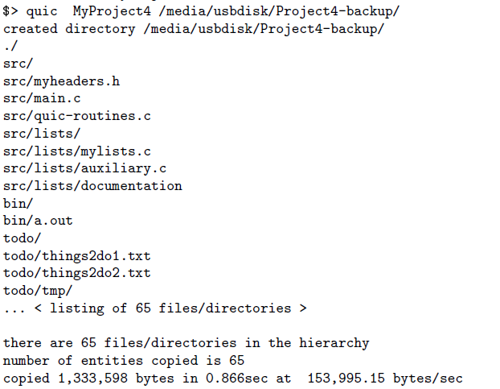

# Quic
Implementation of Quic system call for Linux based systems.

Goal of this program is to copy quickly and effectively the hierarchy of folders and files when this procedure is needed repeatedly. A realistic case would be the synchronization of data in a remote desktop. The program understands which parts of the folder to be copied have been changed in order to renew the copy. In that way, computing time is beeing saved.
It is important to mention, that in the first execution the code functions as the linux command "cp". Furthermore, all meta-data are copied too.
If a file is deleted in the original folder, the program deletes the respective file also in the copy.

## Folder Definition

## Execution
The program is executed as followed:
`` ./quic -v -d -l origindir destdir ``,
where
- quic is the executable
- origin dir is the directory to be copied
- v is the verbose flag, that prints info messages during execution
- d informs the program that files are deleted in the original directory
- l informs the program if soft and hard links should be considered during execution
A makefile has been created to facilitate the execution. Inside makefile a variety of option is given for debugging.

## Example
A graphic example would be like this: 

